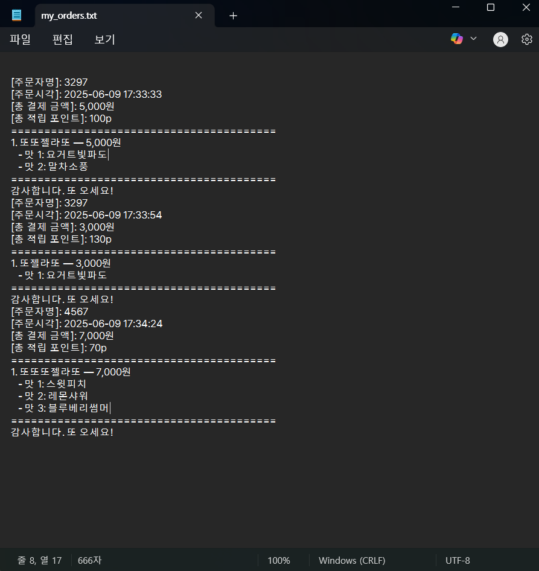

파이썬 기본기를 쌓아가며 작고 소중한 실습들을 하나씩 완성해나갔다.

이번에는 팀원과 함께 젤라또 키오스크 시스템을 만들어보며,  
파이썬의 변수, 조건문, 반복문, 함수 등  
기초 문법들을 직접 연결해서 하나의 프로그램으로 구성해보았다.

과연… 우리의 코드도 진짜 가게처럼 잘 돌아갈 수 있을까……?

```py
import datetime

# 전역 변수 선언 (공통 사용)
store_name = '또!젤라또'

menu_list = [
    {'name':'또젤라또','count':'1가지맛', 'price':3000},
    {'name':'또또젤라또','count':'2가지맛', 'price':5000},
    {'name':'또또또젤라또','count':'3가지맛', 'price':7000}
]

flavor_list = [
    {'flavor':'달콤초코봄바람'},
    {'flavor':'새콤달콤딸기정원'},
    {'flavor':'요거트빛파도'},
    {'flavor':'말차소풍'},
    {'flavor':'체리팝송'},
    {'flavor':'포도에몽'},
    {'flavor':'바닐라하모니'},
    {'flavor':'쿠키크러쉬'},
    {'flavor':'소금바다우유'},
    {'flavor':'블루베리썸머'},
    {'flavor':'스윗피치'},
    {'flavor':'레몬샤워'},
]

point_list = []
all_orders = []

# ================= 함수 정의 =================

def select_menu():
    """
    메뉴를 선택하는 함수.
    선택된 메뉴 인덱스를 반환.
    """
    print("="*45)
    print(f'{store_name:^40}')
    print("="*45)
    print("어서오세요 아이스크림을 또 주는 또젤라또입니다\n")

    for i, menu in enumerate(menu_list):
        print(f'{i + 1}. {menu["name"]:<6} {menu["count"]:>12} {menu["price"]:>10,}원')
    print("="*45)

    order_input = input('주문할 메뉴 번호를 입력해주세요: ').strip().lower()

    if not order_input.isdigit() or not (1 <= int(order_input) <= len(menu_list)):
        print("잘못된 입력입니다. 다시 시도해주세요.\n")
        return None

    return int(order_input) - 1


def select_flavors(selected_menu):
    """
    맛 선택 함수
    선택한 메뉴에 따라 선택해야 하는 맛의 개수만큼 입력을 받음

    Args:
        selected_menu (dict): 사용자가 선택한 메뉴 정보 (name, count, price 포함)

    Returns:
        list[str] | None: 선택된 맛 리스트 (정상 선택), 0 입력 시 None 반환
    """
    flavor_count = int(selected_menu['count'][0])
    print(f"\n'{selected_menu['name']}' 선택 — {flavor_count}가지 맛을 골라주세요")

    cols_per_row = 3
    for i, fla in enumerate(flavor_list):
        print(f"{i+1}. {fla['flavor']:<10}", end='')
        if (i + 1) % cols_per_row == 0 or i == len(flavor_list) - 1:
            print()

    flavor_input = input("\n맛 번호들을 입력하세요 (예: 1, 3, 5) / 0 입력시 메뉴 선택으로 돌아가기: ").strip()

    if flavor_input == '0':
        print("맛 선택을 취소하고 메뉴로 돌아갑니다.\n")
        return None  # flavor_canceled 대신 None 반환

    parts = flavor_input.split(',')
    flavor_nums = [int(p.strip()) - 1 for p in parts if p.strip().isdigit()]

    if len(flavor_nums) != flavor_count or any(i < 0 or i >= len(flavor_list) for i in flavor_nums):
        print(f"정확히 {flavor_count}가지 맛을 정확히 입력해주세요.")
        return []

    selected_flavors = [flavor_list[i]['flavor'] for i in flavor_nums]
    return selected_flavors


def cart(orders, selected_menu, selected_flavors):
    """
    주문 확인 및 장바구니 추가 함수
    현재 선택한 메뉴와 맛을 출력하고 사용자에게 장바구니 추가 여부를 확인

    Args:
        orders (list): 현재 주문 목록 리스트 (dict 요소)
        selected_menu (dict): 선택된 메뉴 정보
        selected_flavors (list): 선택된 맛 리스트

    Returns:
        bool: 장바구니에 추가(True), 취소(False)
    """
    print("\n선택한 주문:")
    print(f"메뉴: {selected_menu['name']}") # 선택한 메뉴(사이즈)
    for idx, name in enumerate(selected_flavors):
        print(f" - 맛 {idx+1}: {name}") #맛 순번과 맛이름
    print(f"가격: {selected_menu['price']:,}원") #총 가격

    while True:
        confirm = input("\n이 주문을 장바구니에 추가할까요? (Y: 추가 / N: 취소): ").strip().lower()
        if confirm == 'y':
            orders.append({
                'menu_name': selected_menu['name'],
                'flavor_names': selected_flavors,
                'price': selected_menu['price']
            })
            print("주문이 장바구니에 추가되었습니다.\n")
            return True
        elif confirm == 'n':
            print("주문이 취소되었습니다.\n")
            return False
        else:
            print('!(Y/N)로 입력해주세요!')


def extra_order():
    """
    추가 주문 여부 확인 함수

    Returns:
        bool: 추가 주문할 경우 True, 아니면 False
    """
    while True:
        another = input("추가 주문하시겠습니까? (Y/N): ").strip().lower()
        if another == 'y':
            return True  # 다시 메뉴 선택으로
        elif another == 'n':
            return False  # 주문 확인 단계로
        else:
            print('!(Y/N)로 입력해주세요!')

def show_orders(orders):
    """
    현재 주문 내역 출력 함수

    Args:
        orders (list): 주문 내역 리스트 (dict 요소)
    """

    if not orders:
        print("현재 주문이 없습니다.")

    else:
        for i, order in enumerate(orders):
            print(f"{i+1}. {order['menu_name']} — {order['price']:,}원")
            for idx, name in enumerate(order['flavor_names']):
                print(f"   - 맛 {idx+1}: {name}")


def canceled(orders):
    """
    주문 취소 처리 함수
    주문 내역을 출력하고 사용자가 취소를 원하는 주문을 삭제할 수 있게 함

    Args:
        orders (list): 현재 주문 내역 리스트

    Returns:
        bool: 남은 주문이 있으면 False (결제 진행) 없으면 True (처음으로 돌아감)
    """
    while True:
        if not orders:
            print("현재 주문이 없습니다.")
            return True

        cancel_q = input("\n주문 내역 중 취소할 주문이 있습니까? (Y/N): ").strip().lower()
        if cancel_q == 'n':
            return False # 취소 안 하고 결제 진행
        elif cancel_q == 'y':
            print("\n다시 주문 내역을 보여드립니다:")
            show_orders(orders)

            del_input = input("취소할 주문 번호를 입력하세요 (0 입력시 결제창으로): ").strip()
            if del_input == '0':
                return False # 결제 진행
            if del_input.isdigit() and 1 <= int(del_input) <= len(orders):
                del_index = int(del_input) - 1
                removed = orders.pop(del_index)
                print(f"'{removed['menu_name']}' 주문이 삭제되었습니다.")
            else:
                print("잘못된 번호입니다.")
        else:
            print("!(Y/N)로 입력해주세요!")


def check_out(orders):
    """
    최종 결제 금액 계산 함수

    Args:
        orders (list): 현재 주문 내역 리스트

    Returns:
        int: 총 결제 금액
    """
    print("\n💳 최종 주문 내역:")
    show_orders(orders)

    total_price = sum(order['price'] for order in orders)
    print('\n' + '='*45)
    print(f"💰 총 결제 금액: {total_price:,}원")
    return total_price


def member_ship(point_list, total_price):
    """
    포인트 적립 처리 함수
    전화번호로 적립 또는 신규 등록

    Args:
        point_list (list): 포인트 정보 저장 리스트
        total_price (int): 총 결제 금액

    Returns:
        str: 전화번호 (회원), 또는 "고객"
    """
    while True:
        point_q = input('포인트 적립하시겠습니까? (Y/N): ').strip().lower()
        if point_q == 'y':
            membership = input("전화번호를 입력해주세요: ").strip()
            saved_point = total_price // 100
            idx = -1

            for i, user in enumerate(point_list):
                if user['membership_nb'] == membership:
                    idx = i
                    break

            if idx != -1:
                point_list[idx]['membership_point'] += saved_point
                total_point = point_list[idx]['membership_point']
            else:
                point_list.append({'membership_nb': membership, 'membership_point': saved_point})
                total_point = saved_point

            print(f"{saved_point}포인트 적립 완료 → 총 {total_point}포인트")
            return membership, total_point  # 🍇 호출부에서 두 값 함께 받기

        elif point_q == 'n':
            return "고객", 0
        else:
            print('!(Y/N)로 입력해주세요!')


# 메인 루프

while True:
    orders = []
    while True:
        order_num = select_menu()
        if order_num is None:
            continue
        selected_menu = menu_list[order_num]

        selected_flavors = select_flavors(selected_menu)
        if selected_flavors is None or not selected_flavors:
            continue

        if not cart(orders, selected_menu, selected_flavors):
            continue

        if not extra_order():
            break  # 주문 루프 종료

    if canceled(orders):
        continue  # 결제 전 주문 모두 취소된 경우 -> 처음부터

    total_price = check_out(orders)
    if total_price == 0:
        print("남은 주문이 없습니다. 처음으로 돌아갑니다.\n")
        continue

    name, total_point = member_ship(point_list, total_price)

    now = datetime.datetime.now().strftime('%Y-%m-%d %H:%M:%S')

    all_orders.append({
        'timestamp': now,
        'orders': orders.copy(),
        'total_price': total_price
    })

    # 🚩 여기! 루프 안, 주문 저장 직후에 위치해야 함
    file_path = "C:/mysrc/my_orders.txt"
    with open(file_path, "a", encoding="utf-8") as f:
        f.write(f"[주문자명]: {name}\n")
        f.write(f"[주문시각]: {now}\n")
        f.write(f"[총 결제 금액]: {total_price:,}원\n")
        f.write(f"[총 적립 포인트]: {total_point}p\n")
        f.write("="*40 + "\n")
        for i, order in enumerate(orders, start=1):
            f.write(f"{i}. {order['menu_name']} — {order['price']:,}원\n")
            for idx, flavor in enumerate(order['flavor_names'], start=1):
                f.write(f"   - 맛 {idx}: {flavor}\n")
        f.write("="*40 + "\n")
        f.write("감사합니다. 또 오세요!\n")
```

---

**출력값**

```
=============================================
                 또!젤라또
=============================================
어서오세요 아이스크림을 또 주는 또젤라또입니다

1. 또젤라또           1가지맛      3,000원
2. 또또젤라또          2가지맛      5,000원
3. 또또또젤라또         3가지맛      7,000원
=============================================
주문할 메뉴 번호를 입력해주세요:  3

'또또또젤라또' 선택 — 3가지 맛을 골라주세요
1. 달콤초코봄바람   2. 새콤달콤딸기정원  3. 요거트빛파도
4. 말차소풍      5. 체리팝송      6. 포도에몽
7. 바닐라하모니    8. 쿠키크러쉬     9. 소금바다우유
10. 블루베리썸머    11. 스윗피치      12. 레몬샤워

맛 번호들을 입력하세요 (예: 1, 3, 5) / 0 입력시 메뉴 선택으로 돌아가기:  11,12,10

선택한 주문:
메뉴: 또또또젤라또
 - 맛 1: 스윗피치
 - 맛 2: 레몬샤워
 - 맛 3: 블루베리썸머
가격: 7,000원

이 주문을 장바구니에 추가할까요? (Y: 추가 / N: 취소):  y
주문이 장바구니에 추가되었습니다.

추가 주문하시겠습니까? (Y/N):  n

주문 내역 중 취소할 주문이 있습니까? (Y/N):  n

💳 최종 주문 내역:
1. 또또또젤라또 — 7,000원
   - 맛 1: 스윗피치
   - 맛 2: 레몬샤워
   - 맛 3: 블루베리썸머

=============================================
💰 총 결제 금액: 7,000원
포인트 적립하시겠습니까? (Y/N):  y
전화번호를 입력해주세요:  4567
70포인트 적립 완료 → 총 70포인트
=============================================
                 또!젤라또
=============================================
어서오세요 아이스크림을 또 주는 또젤라또입니다

1. 또젤라또           1가지맛      3,000원
2. 또또젤라또          2가지맛      5,000원
3. 또또또젤라또         3가지맛      7,000원
=============================================
주문할 메뉴 번호를 입력해주세요:
```

## 누적된 주문 리스트를 .txt로 관리하기

{: style="width:400px;" }

---

## 오늘을 마치며

오늘은 단순히 기능을 구현하는 것을 넘어서,  
각각의 역할을 함수로 분리하고 흐름을 체계적으로 구성하는 리팩토링의 힘을 느낄 수 있었다.

입력, 처리, 저장까지 모든 과정을 함수로 나누고 조립하면서,  
파이썬 코드가 점점 '읽히는 프로그램'이 되어가는 과정이 신기하고 재미있었다.

> 작은 아이스크림 가게를 닮은 나만의 시스템을 만들어낸 오늘,  
> 프로그래밍이 점점 더 실생활과 가까워지고 있다는 걸 실감했다.
