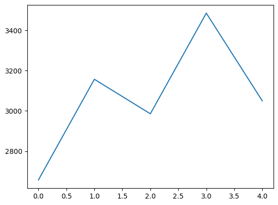

```py

# 30일 동안의 매출 
sales_data = np.array([2200, 2350, 2500, 2750, 3000, 3100, 2700, 2600, 2900, 3200,
                       3400, 3600, 3300, 3100, 2900, 2700, 2800, 2900, 3100, 3200,
                       3300, 3400, 3500, 3700, 3600, 3500, 3400, 3300, 3000, 3100])


# 한 달 간 평균 매출
avg_sales = np.mean(sales_data)
print("한 달 평균 매출", avg_sales)


# 최대 매출일, 최소 매출일
sales_data.shape
max_day, min_day = sales_data.argmax(), sales_data.argmin()
print(f'최대 매출일: {max_day+1} 최소 매출일: {min_day+1}')


# 7일 단위로 매출 합계 계산
weekly_data = np.pad(sales_data, (0,5), 'constant', constant_values=0).reshape(5,7)
weekly_data

print("주별 합계:", weekly_data.sum(axis=1))
print("요일별 합계:", weekly_data.sum(axis=0))


# 매출이 2800에서 3500 사이인 날들의 평균 매출을 계산
cond = (sales_data >= 2800)&(sales_data<=3500)
cond_avg = sales_data[cond].mean()
print("특정 범위 내 매출 평균값:", cond_avg)


# matplotlib 모듈 불러오기
import matplotlib.pyplot as plt


# 7일 단위 매출 합계 계산 시 값이 0으로 들어감(매출 계산 오류 해결방안)
# 0 ➡️ nan 으로 변경
# matplotlib 그래프 출력
weekly_data_1 = weekly_data.copy().astype(float)
weekly_data_1[weekly_data_1==0] = np.nan

weekly_mean = np.nanmean(weekly_data_1, axis=1)
print(weekly_mean)
plt.plot(weekly_mean)


#각 주차별 최고 매출 요일 출력
arr = np.array(weekly_data_1)
days = ['월', '화', '수', '목', '금', '토', '일']

for i in range(arr.shape[0]):
    max_day_idx = np.nanargmax(arr[i])
    max_sales = int(arr[i, max_day_idx])
    print(f"[{i+1}주차] {days[max_day_idx]}요일에 최고 매출: {max_sales}만원")


```
```py
# 출력값
한 달 평균 매출 3070.0
최대 매출일: 24 최소 매출일: 1
주별 합계: [18600 22100 20900 24400  6100]
요일별 합계: [14100 14550 12200 12650 13200 13000 12400]
특정 범위 내 매출 평균값: 3170.0
[2657.14285714 3157.14285714 2985.71428571 3485.71428571 3050.        ]
[1주차] 토요일에 최고 매출: 3100만원
[2주차] 금요일에 최고 매출: 3600만원
[3주차] 일요일에 최고 매출: 3300만원
[4주차] 수요일에 최고 매출: 3700만원
[5주차] 화요일에 최고 매출: 3100만원
```

{: style="width:400px;" }