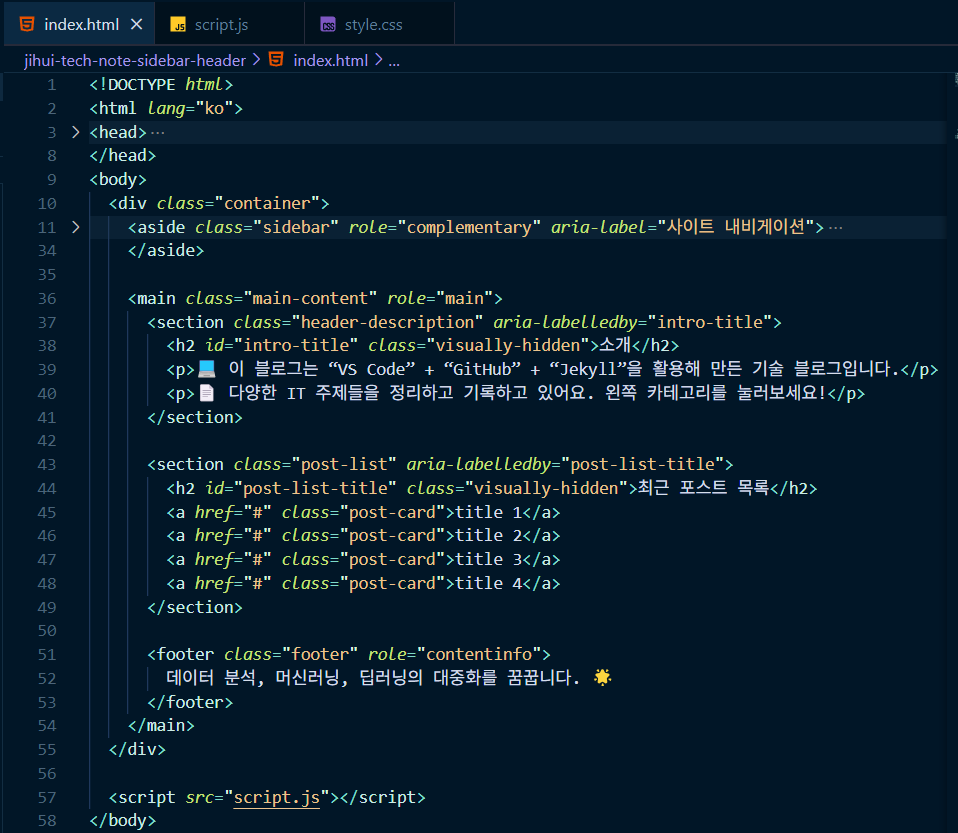
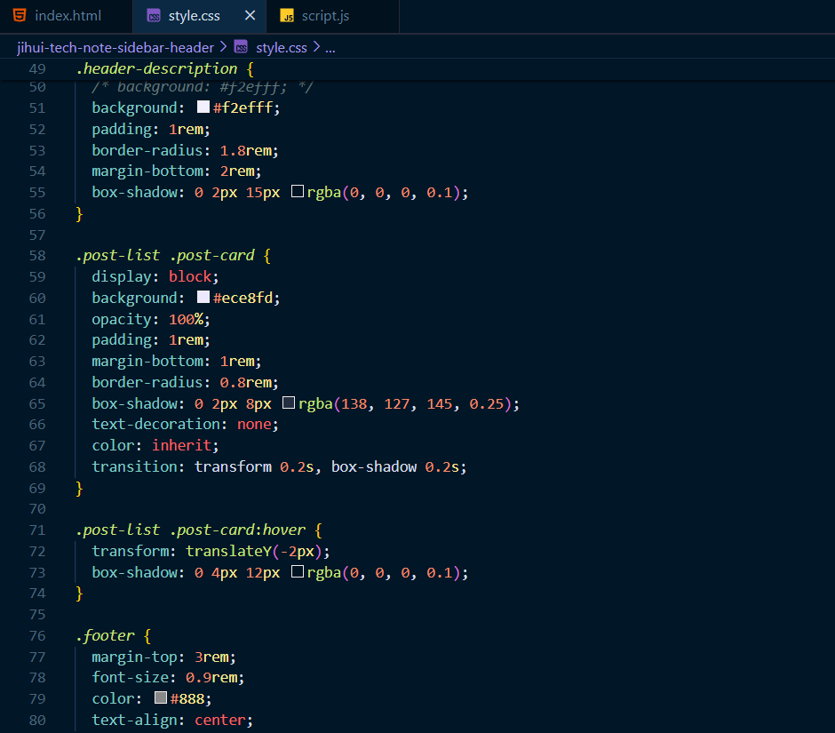
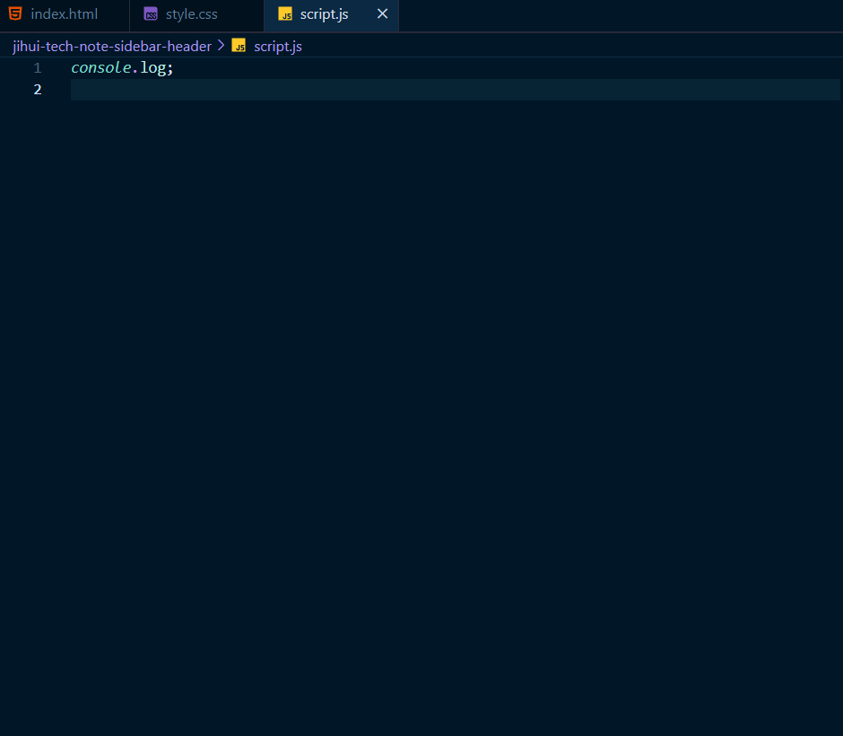

웹 기술을 배우면서 "우와!" 했던 순간이 있다.

**내가 만든 HTML 파일이, 웹 브라우저에서 실제로 열리는 걸 봤을 때.**

처음엔 그냥 분석 결과만 잘 정리하면 되는 줄 알았는데,  
막상 웹에 띄워보니까 느낌이 완전히 달랐다.

누군가 내 데이터를 클릭해서 보고,  
이해하고, 반응할 수 있다는 게 신기했다.

**‘전달’까지 내 손으로 할 수 있다는 거,  
분석가로서 꽤 짜릿한 경험이었다.**

그런데 이거, 생각보다 어렵지도 않았다.  
**GitHub랑 GitHub Pages만 있으면 바로 시작할 수 있다!**

---

## GitHub 계정 만들기

1. [github.com](https://github.com) 접속해서 회원가입
2. 이메일, 비밀번호, 사용자 이름 → 🔒꼭 기억해둘 것!
3. 인증 메일 확인 후 완료

---

## 저장소 만들기

1. 로그인 후, 오른쪽 상단 `+` 클릭 ➡️ `New repository`
2. 저장소 이름: ex) `web-start`
3. 옵션 설정
   - `Public` 저장소 선택
   - `README 파일 추가` 체크
   - `.gitignore` , license 는 생략 가능

---

## 파일 업로드 & 커밋하기

1. 저장소 ➡️ `Add file` ➡️ `Upload files`
2. `.html`, `.css`, `.js`, 이미지 등 웹파일 업로드
3. 아래 `Commit changes`란에 메시지를 작성하고 커밋
   > **커밋**: "이 파일, 이렇게 바꿨어요"라고 GitHub에 알려주는 동작

---

## README.md 는 "Identity"

`README.md` 파일은 _이 저장소가 어떤 프로젝트인지_ 소개하는 첫인상이다.  
**마크다운 문법을 활용**해 간단히 작성할 수 있다.

<br>

**예시**

```markdown
<!-- markdown 으로 작성한 문서입니다. -->

## 프로젝트 소개

처음 배우는 HTML, CSS로 만든 웹페이지입니다.  
GitHub Pages를 활용해 배포해보는 실습용 저장소입니다.
```

## 사용 기술

1. **index.html** : 메인 웹페이지



2. **style.css** : 스타일 정의



3. **JAVASCRIPT** : 웹 페이지 동적 상호작용



## GitHub Pages로 배포하기

**첫번째 방법: github 저장소에서 배포**

1. - 저장소 ➡️ Settings ➡️ Pages 메뉴

1. - Branch: main, root 선택 ➡️ Save

1. - 몇 분 후 배포 주소 생성됨 (https://사용자명.github.io/저장소명/)

1. - 웹사이트의 대문은 index.html로 설정해야 자동 인식됨

<br>

**⭐ 두번째 방법: VS Code TERMINAL에서 배포**  
_VS Code 하단 TERMINAL에서 바로 명령어 입력_

1. - git add .
1. - git commit -m "docs: 문서 관련 커밋 메시지"
1. - git push

> ※ 기능적인 부분 추가 시: `feat`,  
> 수정 시: `fix`,  
> 문서 작성: `docs` 등으로 커밋 메시지를 작성하면 좋다.

## Git & GitHub 핵심 명령어 정리

| 목적                                   | 명령어                   |
| -------------------------------------- | ------------------------ |
| 수정된 파일 안전 보관                  | `git stash`              |
| 원격 저장소 복제                       | `git clone`              |
| 원격 저장소의 최신 gh-pages를 가져오기 | `git fetch origin`       |
| 원격 저장소의 변경사항 반영            | `git pull`               |
| 변경사항이 있다면 스테이징 전 보관     | `git status`             |
| 변경사항 추가                          | `git add .`              |
| 변경사항 저장 (커밋)                   | `git commit -m "메시지"` |
| 원격 저장소로 푸시                     | `git push`               |

> **Git**: 로컬(내 컴퓨터)에서 소스를 관리하는 도구  
> **GitHub**: 그 소스를 저장하는 온라인 공간

---

## 💡 Tip

1. CSS, 이미지, JS 파일까지 **모두 함께 업로드**해야 웹페이지가 정상적으로 작동
2. 파일명에는 **공백, 한글, 특수문자**를 비추
3. GitHub Pages 배포에는 **약간의 반영 지연**이 있을 수 있으니, 몇 분 후 새로고침!

---

## 오늘을 마치며

처음엔 어렵게 느껴졌던 GitHub와 Git, 그리고 배포.  
하지만 한 번 과정을 따라가 보니  
**웹사이트를 만드는 흐름이 훨씬 명확해졌다.**  
이제는 포트폴리오 작성이나 협업 프로젝트에서도

> **스스로 해낼 수 있을 것 같은 자신감이 생긴다.**
