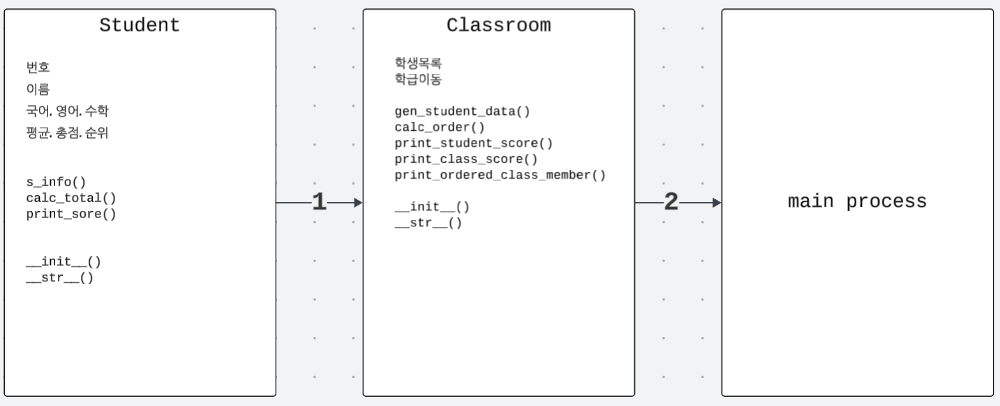

모듈이 있는데 왜 굳이 클래스를 써야 하는 거지?  
코드를 잘 짜고 있었는데 말이지.

그런데 점점 기능이 많아지고, 변수들이 얽히기 시작하면서 이런 생각이 들었다.  
*"이 함수는 어디에 쓰는 거였지? 이 변수는 누구 거였더라?"*🤔

모듈은 기능을 묶는 데엔 좋지만, 데이터와 행동을 하나로 묶어주진 못한다.

그때 등장한 게 바로 클래스!  

마치 **'설계도'**처럼 속성과 기능을 함께 정의할 수 있어서  
복잡해진 코드를 깔끔하게 정리하고, 더 체계적으로 다룰 수 있게 해준다.

---

## 클래스란?
• 객체를 만들기 위한 설계도     
• 새로운 데이터 타입을 정의    
• 데이터(속성) 와 기능(메서드) 을 하나로 묶는 구조    
• 비슷한 구조의 데이터를 효율적으로 다룰 수 있다.

```py
class Student:
    def __init__(self, name):
        self.name = name
```
**예제 설명**

| 구성 요소                       | 설명                                |
| --------------------------- | --------------------------------- |
| `class Student:`            | `Student`라는 이름의 클래스를 정의함 (설계도 역할) |
| `def __init__(self, name):` | 생성자 메서드. 객체가 생성될 때 자동으로 호출됨       |
| `self`                      | 생성된 객체 자신을 가리키는 키워드               |
| `self.name = name`          | 전달받은 `name` 값을 객체의 속성으로 저장        |

---

## 클래스와 객체(instance)
• 객체(인스턴스) : 클래스에 따라 만들어진 실제 데이터  

```py
s1 = Student("지희")
print(s1.name)  # 지희
```
**예제 설명**

| 실행 코드                | 설명                                         |
| -------------------- | ------------------------------------------ |
| `s1 = Student("지희")` | 클래스 `Student`의 인스턴스 `s1`을 생성하고 `"지희"`을 전달함 |
| `print(s1.name)`     | `s1` 객체의 `name` 속성 출력 → `"지희"` 출력됨         |

---

## 3. 클래스가 필요한 순간
• 같은 구조의 데이터를 여러 개 다뤄야 할 때  
• 함수를 묶어서 쓰고 싶을 때  
• 데이터를 체계적으로 관리하고 싶을 때

---

## 4. 객체지향 프로그래밍이란?
• 클래스 안에 반복적으로 쓰일 기능을 정의한다.  
• 이를 재사용하는 프로그래밍 방식이다.

---

## 5. 클래스 정의 문법
```py
# 클래스 작성 규칙
class 클래스이름:
    def __init__(self, 매개변수):
        self.속성 = 매개변수

    def 메서드이름(self):
        실행할 코드
```
**1) 규칙 설명**

| 구성 요소            | 의미      | 규칙 설명                                      |
| ---------------- | ------- | ------------------------------------------ |
| `class 클래스이름:`   | 클래스 선언  | `class` 키워드 + 이름 + 콜론 `:` 필수               |
| `def __init__()` | 생성자 메서드 | 객체 생성 시 자동 호출되는 함수, 이름은 **반드시 `__init__`** |
| `self`           | 인스턴스 자신 | 메서드의 첫 번째 인자는 항상 `self`로 고정           |
| `self.속성 = 값`    | 속성 정의   | `self.속성명` 형태로 인스턴스 변수 생성                  |

**2) 요약 설명**   
• `__init__` 이름은 반드시 *언더스코어 두 개씩* 붙이기   
• `self`는 *메서드 안에서* 객체 자신을 꼭 가리키기   
• 클래스 이름은 관례적으로 *첫 글자를 대문자로* 쓰기 (`Student`, `Car` 등)

---

## 6. 인스턴스 vs 클래스 변수

```py
class Student:
    school = "파이썬 고등학교"  # 클래스 변수

    def __init__(self, name):
        self.name = name  # 인스턴스 변수

s1 = Student("지희")

print(s1.name)              # 인스턴스 변수 → 지희
print(Student.school)       # 클래스 변수 → 파이썬 고등학교
print(isinstance(s1, Student))  # True

```

**예제 설명**

| 구분               | 설명                                     | 예시                                 |
| ---------------- | -------------------------------------- | ---------------------------------- |
| **인스턴스 변수**      | 각 객체가 **따로 가지는 속성**. 인스턴스마다 값이 다를 수 있음 | `self.name`                        |
| **클래스 변수**       | **모든 객체가 공유**하는 변수. 클래스 이름으로 접근함       | `Student.school`                   |
| **isinstance()** | 객체가 **특정 클래스의 인스턴스인지 확인**하는 함수         | `isinstance(s1, Student)` → `True` |


---
## 7. 메서드 종류

| 메서드      | 특징            | 데코레이터         |
| -------- | ------------- | ------------- |
| 인스턴스 메서드 | 객체 속성에 접근 가능  | 없음            |
| 클래스 메서드  | 클래스 속성에 접근 가능 | @classmethod  |
| 정적 메서드   | 독립적인 기능 구현    | @staticmethod |

---
## 8. 캡슐화
• 접근 제한을 통해 객체 내부 데이터를 보호  
• 변수명 앞 언더스코어로 표현

| 접근 수준     | 형식       | 설명       |
| --------- | -------- | -------- |
| public    | `name`   | 공개       |
| protected | `_name`  | 내부 사용 권장 |
| private   | `__name` | 완전 비공개   |

---

## 9. 상속과 오버라이딩
• **상속(inheritance)**: 부모 클래스의 속성과 기능을 자식 클래스가 물려받음   
• **오버라이딩(overriding)**: 자식 클래스에서 부모 메서드를 재정의하여 기능 변경

**실습 내용**

```py
# 부모 클래스 정의
class Calculator:
    def __init__(self, x, y):
        self.x = x
        self.y = y

    def add(self):
        return self.x + self.y

# 자식 클래스
class AdvancedCalculator(Calculator):  # 대소문자 주의
    # 자식이 추가한 기능
    def divide(self):
        if self.y == 0:
            return '0으로 나누기 금지'
        return self.x / self.y

    def mul(self):
        if self.x == 0:
            return '0으로 곱하기 금지'
        return self.x * self.y

    def sub(self):
        return self.x - self.y

    # 오버라이딩된 기능
    def add(self):  # overriding
        print('advanced calculator입니다.')
        return super().add()
```
```py
#실행 코드
ac = AdvancedCalculator(10, 0)

print(ac.add())     # advanced calculator입니다. \n 10
print(ac.divide())  # 0으로 나누기 금지
print(ac.mul())     # 0으로 곱하기 금지
print(ac.sub())     # 10
```

---

## 10. 객체 확인
• type()으로 객체의 타입 확인 가능   
• 파이썬 기본 자료형도 클래스이다 (예: int, str 등)

```py
class Student:
    pass

s = Student()
print(type(s))  # <class '__main__.Student'>
```

## 11. 객체 간 역할과 흐름 정리도

{: style="width:800px;" }   
`Student → Classroom → main process로 이어지는 클래스 중심의 프로그램 흐름도`   

---
## 오늘을 마치며
클래스, 알고 보면 참 든든한 친구다.  
내 코드를 정돈해주고, 더 나아갈 수 있게 도와준다.  

> 앞으로도 함께하면서 더 좋은 코드를 만들어가길!🙏✨


