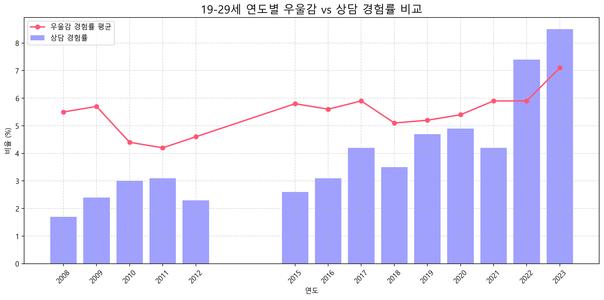
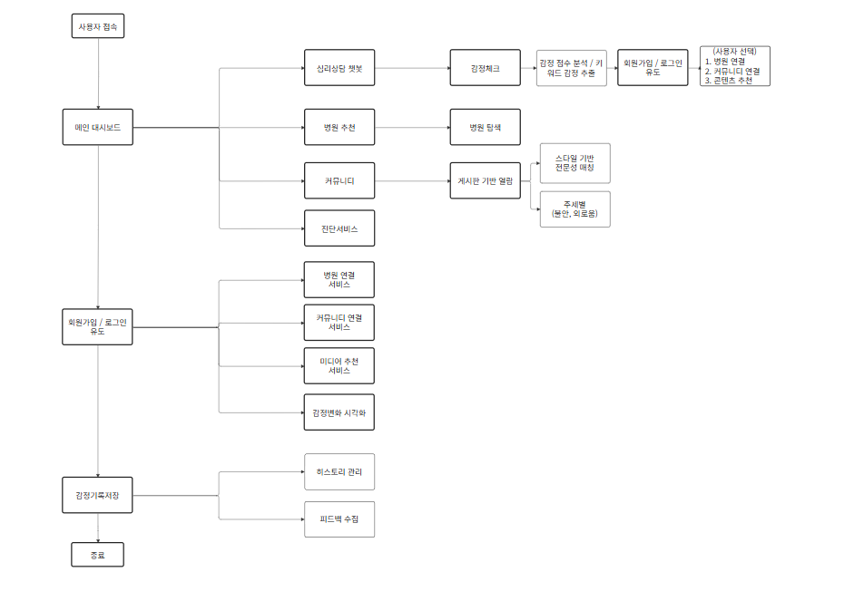
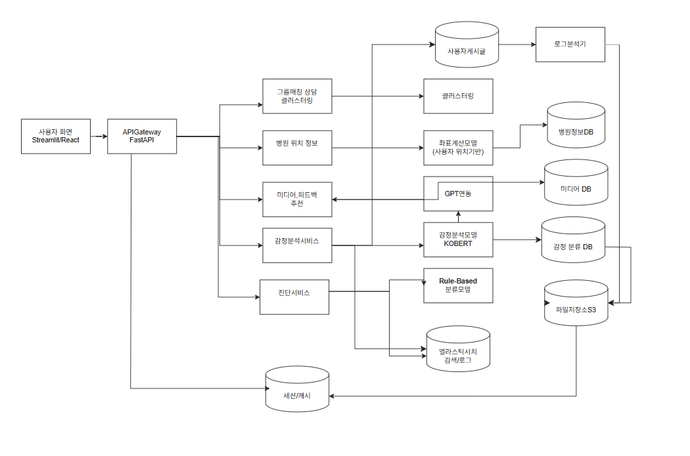

드디어, 프로젝트의 세계에 발을 들였다.   

지난 화요일부터 팀원 구성, 개인의 포지션과 프로젝트 주제를 정하고,   
수요일부터 본격적으로 프로젝트를 진행했다.

나는 *“진짜 쓸 수 있는 모델”*을 만들어보고 싶다는 마음으로 이 프로젝트를 시작했다.  

내가 만든 모델이 누군가의 하루에    
조금이라도 스며들 수 있으면 좋겠다는 생각으로 시작한 **감정 분석 프로젝트**.   
KoBERT 기반으로 데이터를 다루고, 모델을 학습시키고, 시각화까지 연결해보며    
*‘나의 분석이 누군가에게 닿는 경험’*을 직접 만들어보고 싶었다.

---

## 1.  프로젝트 주제
이번 프로젝트의 주제는 **감정 분석 기반 추천 서비스 구축**이었다.   

처음에는 단순히 텍스트 감정 분석만 해보고 싶었는데,    
진행하면서 **분석 결과를 서비스까지 연결해보고 싶다는 욕심**이 생겼다.   
*“누군가의 하루에 스며드는 모델”*이라는 말처럼,    
내가 만든 모델이 **누군가의 기분을 조금이라도 가볍게 만들어줄 수 있다면 좋겠다**는 마음으로 진행했다.

---

## 2. 문제 정의
요즘 마음이 힘들 때,    
AI와 대화로 외로움을 달래는 사람들이 늘고 있다.

하지만 이 대화는 **근본적인 위로나 해결로 이어지지 못하는 경우가 많다.**

> 아래 그래프를 보면 우울감을 겪는 청년들이 꾸준히 늘어나고 있지만,   
> 상담으로 이어지는 비율은 여전히 낮다.   
> 이 현실이 변해야 한다.

 
 

{: style="width:800px;" }
*출처: 보건복지부 정신건강실태조사*(온오프라인 정신 상담 경험)
 
 
 
정서적 고립을 해소하고,   
누구나 편하게 감정을 털어놓고   
공감받을 수 있는 공간이 필요하다.

이 프로젝트는 
**감정을 분석하고,**    
**맞춤형 콘텐츠로 작은 위로를 전하는 서비스**를   
만드는 것에서 시작했다.

---

## 3. 프로젝트 정의

> 마음을 털어놓을 곳이 없을 때,   
> 말 한마디가 위로가 될 수 있다면 얼마나 좋을까.

이 프로젝트는   
**누구나 쉽게 감정을 털어놓고,**   
**공감과 작은 위로를 받을 수 있는**   
서비스를 만드는 것을 목표로 시작했다.

### 1) 프로젝트 개요
**(1) 프로젝트명**    
*츄!러스 미*     
**(2) 목표**    
① 로그인 없이도 바로 시작 가능한 감정 기반 AI 상담 서비스 구축     
② 감정 분석 결과를 바탕으로 *맞춤형 콘텐츠 추천,*    
*병원·상담사 연계, 커뮤니티 연계*까지 이어지는 정서 지원 서비스 설계      
**(3) 방식**    
①KoBERT 감정 분석   
②감정 맞춤 콘텐츠 추천   
③병원/상담사/커뮤니티 연계   
④정서적 고립 해소

### 2)  서비스 필요성
• 우울, 불안, 외로움을 겪는 사람들이 늘어나지만 상담으로 연결되기까지의 장벽이 높음      
• 기존 상담 서비스는 예약·회원가입 중심이라 즉각적 위로 제공이 어려움     
• 즉각적인 공감과 작은 위로부터, 필요 시 실질적인 상담 연결까지 이어주는 서비스가 필요

### 3) 핵심 기능 요약

| 기능             | 내용                           |
| -------------- | ---------------------------- |
| **🧔AI 감정 상담**   | KoBERT 기반 감정 분석, 즉시 공감 대화 제공 |
| **🩷콘텐츠 추천**     | 감정별 음악, 영화/드라마 대사, 글귀 추천     |
| **💉병원/상담사 연계**  | 위치·증상 기반 병원, 상담사 추천 및 예약     |
| **👨‍👩‍👧‍👦커뮤니티/그룹 상담** | 감정 기반 오픈 그룹 및 익명 커뮤니티        |
| **📖감정 일기**      | 일별 감정 기록 및 추적                |
| **📢위기 대응**      | 자살 충동·위험 감지 시 즉시 도움 번호 안내    |
| **🏃‍➡️운동/맛집 추천**   | 심리 상태 기반 운동, 음식 추천           |

### 4) 데이터 및 모델
• **데이터:** AI Hub 한국어 감정 데이터셋, 추가 수집 일상 텍스트   
• **모델:** KoBERT 기반 6가지 감정 분류(행복, 슬픔, 혐오, 두려움, 놀라움, 분노)   
• **기반 기술:** Pandas, PyTorch, Matplotlib, Colab/VS Code

---

## 4. 벤치마킹

우리의 타겟은 
**취업 준비로 인한 스트레스와 외로움, 우울감을 겪는 20대 청년들**이다.   
이들에게 ‘로그인 없이 바로 시작할 수 있는 감정 상담 서비스’를 제공하기 위해,   
어떤 서비스가 이미 시도되었고 어떤 한계가 있었는지 파악하는 것이 필요했다.

### 1) 벤치마킹 서비스
**(1) 마인드그라운드**   
① 감정 기반 콘텐츠 큐레이션(에세이, 음악, 글귀) 제공    
② 콘텐츠 소비 중심으로 실시간 상호작용 한계

**(2) 트로스트**   
① 앱 기반 비대면 심리상담 서비스   
② 전문 상담 중심, 즉시 위로/공감 어려움, 진입장벽 높음

**(3) Spotify Mood Playlist**   
① 감정에 따른 음악 추천 플레이리스트 제공   
② 음악 제공 중심, 심리 분석/상담 연계 X

**(4) ChatGPT, Mind AI 챗봇**   
① AI와 대화로 외로움 해소 시도   
② 근본적 위로 및 문제 해결 한계

### 2)벤치마킹으로 얻은 인사이트
① 즉시 공감, 바로 위로, 접근성의 중요성   
② 단순 콘텐츠 제공을 넘어 사용자 감정 분석 기반 맞춤형 추천의 필요성   
③ 필요 시 병원/상담사 연계로 이어지는 실질적 도움

---

## 5. 프로젝트 목표 요약

### 1) 서비스 핵심 기능 (요구사항 정의서 요약)
① 누구나 로그인 없이 바로 시작할 수 있는 AI 감정 상담 서비스   
② KoBERT 기반으로 텍스트에서 6가지 감정을 분석하고, 즉시 공감 멘트 제공   
③ 분석된 감정에 따라 맞춤형 음악, 영화/드라마 대사, 글귀 추천   
④ 필요시 병원/상담사 연결까지 이어져 실질적인 도움 제공   
⑤ 감정 일기 기능으로 나의 감정 변화 추이를 시각화하여 확인 가능   
⑥ 위기 상황(자살 충동 등)에는 즉각적으로 도움받을 수 있는 번호 안내

### 2) 기능 요약

| 구분          | 내용                              |
| ----------- | ------------------------------- |
| **상담**      | KoBERT 기반 AI 감정 분석, 즉시 공감 멘트 제공 |
| **추천**      | 감정별 맞춤형 콘텐츠(음악/영화/글귀) 추천        |
| **연계**      | 위치·증상 기반 병원/상담사 정보 제공 및 예약 연계   |
| **커뮤니티**    | 감정 기반 오픈 그룹 상담/익명 커뮤니티          |
| **기록**      | 감정 일기, 감정 추이 시각화                |
| **보안/개인정보** | 로그인 없는 익명 사용, 필요시 선택적 회원 전환     |
| **위기 대응**   | 위기 상황 감지 시 도움 번호 즉시 안내          |

### 3) 개발 및 운영 기준
① 모바일/웹 환경 모두 대응 가능하도록 설계   
② 빠르고 안정적인 응답 속도를 유지   
③ 개인정보 보호와 보안을 고려한 구조로 개발

### 4) 서비스 흐름도
{: style="width:800px;" }

> *츄!러스미* 서비스가    
> **사용자의 텍스트 입력부터 감정 분석, 콘텐츠 추천, 상담 연계**까지    
> 어떻게 작동하는지 한눈에 볼 수 있는 흐름도이다.

### 5) 서비스 구성도
{: style="width:800px;" }

> *츄!러스미* 서비스가    
> **어떤 기능으로** 구성되어 있는지,    
> 각각의 기능이 **어떻게 연결되는지** 보여주는 구성도이다.

---

## 6. WBS (팀 최종 프로젝트 일정)

| 단계                  | 내용                                                              |
| ------------------- | --------------------------------------------------------------- |
| **(0) 프로젝트 기획**     | 기획서, 벤치마킹, 페르소나 정의, 요구사항 정의서, 서비스 흐름도·구성도·UI 설계, 프로토타입, 발표자료 제작 |
| **(1) AWS 환경 개발**   | 클러스터링, 병원 위치 좌표 계산, 미디어 DB 크롤링, KoBERT 감정 분석, Rule-Based 진단 분류  |
| **(2) 그룹 매칭 상담 개발** | K-Means 기반 사용자 감정/행동 군집화                                        |
| **(3) 병원 위치 정보**    | 위치 데이터 수집, 거리 계산, 지도 연동                                         |
| **(4) 미디어·피드백 추천**  | GPT+감정분석 기반 추천 모델 학습·배포, 사용자 시나리오 테스트                           |
| **(5) 감정 분석 서비스**   | KoBERT 학습·파인튜닝, 데이터 라벨링, 자동 분류 및 DB 저장, 시각화 대시보드                |
| **(6) 진단 서비스**      | 자가진단 문항 기반 심리 상태 분류, 시각화                                        |
| **(7) 테스트**         | 단위·통합·시스템·성능·사용성 테스트 진행                                         |
| **(8) 발표**          | 최종 보고서, 최종 발표 자료 제작                                             |

---

## 7. 날짜별 진행 기록

| 날짜      | 진행 내용                                                   |
| ------- | ------------------------------------------------------- |
| **1일차** | 프로젝트 기획서 작성, 문제 정의, 상세 주제 선정, 벤치마킹, 데이터 조사              |
| **2일차** | 요구사항 정의서 작성, README 파일 초안, 서비스 흐름도/시스템 구성도 제작, UI 샘플 제작 |
| **3일차** | WBS 작성, 프로토타입 제작, 발표 자료 정리                              |

---

## 8. 어려웠던 점과 해결방안

**😮‍💨 어려웠던 점**   
① 프로젝트 주제를 구체화하는 과정에서 방향을 잡는 것에 대한 어려움   
② 어떤 모델을 사용할지, 어떤 데이터가 필요한지 조사하는 과정의 낯설음      
③ 서비스를 실제로 어떻게 연결할 수 있을지 서비스 플로우 구성의 이해도

**💡 해결 방법**   
① 팀원들과 역할을 나누고 구체적인 ‘문제 정의’부터 다시 잡아가며 명확한 방향성 제시   
② KoBERT, GPT, 감정 분석 모델 등의 사례를 조사하며 실제 적용 가능성 탐색   
③ 기존 서비스 벤치마킹, 사용자 페르소나 작성으로 ‘사용자가 이 서비스를 왜 쓰는가’를 구체화해 서비스 플로우 설계

---

## 3일간의 프로젝트를 마치며
아직 모델을 학습해보지 못했고, 데이터도 충분히 만져보지 못했지만,   
이번 프로젝트를 통해 *‘서비스 기획부터 모델 조사, 데이터 조사까지 직접 할 수 있다’*는    
자신감을 얻었다.

> 이제 다음 단계에서는   
> 직접 데이터를 수집해 보고,   
> KoBERT, GPT 등 감정 분석 모델을 돌려보며,   
> 서비스와 연결 가능한 간단한 MVP 형태라도 구현해보고 싶다.